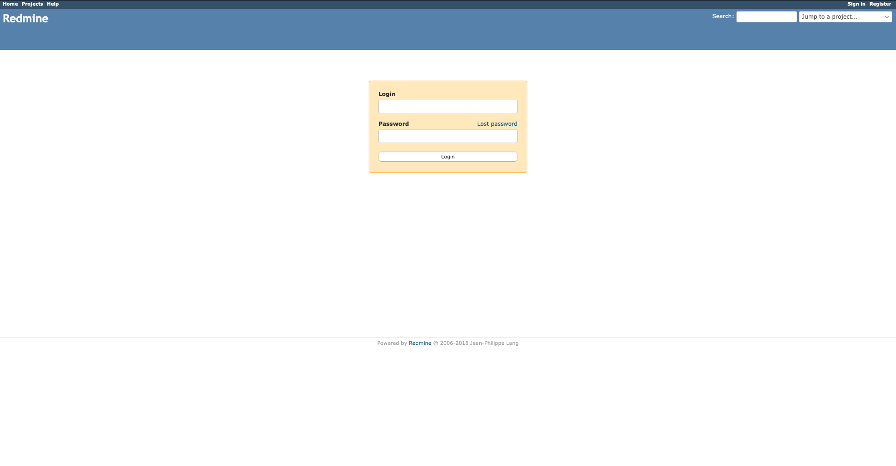

이번 포스트에서는 Ubuntu 18.04 환경에서 레드마인을 설치하는 방법에 대해 알아보겠습니다.

> root 액세스 또는 sudo 권한이 있는 사용자로 작업해야 합니다.

## Step 1. Package Update
우분투 18.04 에 접속한 다음 다음 명령어를 실행하여 패키지를 업데이트해 줍니다.

``` bash
$ apt-get update
$ apt-get upgrade
```

## Step 2. Install MySQL
다음으로 MySQL 서버를 설치해야 합니다. Ubuntu 18.04는 미리 설치된 저장소를 통해 설치할 수 있는 최신 버전의 MySQL을 가지고 있습니다.

다음 명령으로 공식 Ubuntu 저장소에서 최신 MySQL 5.7 서버를 설치합니다.

``` bash
$ apt-get install mysql-server -y
```

위 명령을 통해 설치가 완료되는 즉시 MySQL 웹 서버가 자동으로 시작됩니다.

다음 명령을 사용하여 서버 재부팅 시 MySQL 서비스가 자동으로 시작되도록 설정할 수도 있습니다.

``` bash
$ systemctl enable mysql
```

다음 명령을 통하여 MySQL을 더욱 안전하게 보호할 수 있습니다.

``` bash
$ mysql_secure_installation
```

이 스크립트는 루트 암호 설정, 원격 루트 로그인 사용 안 함, 익명 사용자 제거 등과 같은 중요한 보안 작업을 수행하는 데 도움이 됩니다. 스크립트에서 루트 암호를 묻는 경우 기본적으로 설정된 루트 암호가 없으므로 [Enter] 키를 누르십시오

## Step 3: Create a Database for Redmine

다음은 Redmine 설치를 위한 데이터베이스를 만들어야 합니다. 다음 명령을 사용하여 MySQL 서버에 로그인하고 MySQL 루트 암호를 입력합니다.

``` bash
$ mysql -uroot -p
```

이후 다음 명령으로 새 MySQL 데이터베이스를 생성하고, 사용자 등록과 권한을 설정해줍니다.

``` bash
CREATE DATABASE redmine_db;
GRANT ALL PRIVILEGES ON redmine_db.* TO 'redmine'@'localhost' IDENTIFIED BY 'r3dm13';
FLUSH PRIVILEGES;
exit;
```

위 명령에서 "r3dm13"를 실제로 사용할 강력한 암호로 바꿔줍니다.

## Step 4: Install Ruby

Ubuntu 18.04 서버에 Ruby를 설치하는 가장 쉬운 방법은 apt package manager를 사용하는 것입니다. 현재 Ubuntu 저장소 버전은 2.5.1이며, 이 포스트 작성 당시의 최신 안정 버전입니다.

``` bash
$ apt-get install ruby-full -y
```

모든 작업이 올바르게 수행되었는지 확인하려면 `ruby --version` 명령을 사용합니다.
출력은 다음과 같습니다.

``` bash
$ ruby --version
ruby 2.5.1p57 (2018-03-29 revision 63029) [x86_64-linux-gnu]
```

### Step 5: Install Nginx and Passenger

Ubuntu 18.04 서버에 Nginx를 설치하기 위해 다음 명령을 입력합니다.

``` bash
$ apt-get install nginx -y
```

다음 두 명령을 사용하여 Nginx가 부팅 시 시작하도록 설정하고 서비스를 시작합니다.

``` bash
$ systemctl start nginx
$ systemctl enable nginx
```

다음으로 Redmine 구동을 위해 필요한 Nginx 모듈인 Passenger를 설치하기 위해 먼저 필요한 패키지 사전 패키지를 다음 명령을 통해 설치합니다.

``` bash
$ apt-get install dirmngr gnupg apt-transport-https ca-certificates
```

repository gpg key를 가져오고 "Phusionpassenger" repository를 활성화합니다.

``` bash
$ apt-key adv --recv-keys --keyserver hkp://keyserver.ubuntu.com:80 561F9B9CAC40B2F7
$ add-apt-repository 'deb https://oss-binaries.phusionpassenger.com/apt/passenger bionic main'
```

repository를 활성화하면 패키지 목록을 업데이트하고 다음을 사용하여  Nginx Passenger 모듈을 설치힙니다.

``` bash
$ apt-get update
$ apt-get install libnginx-mod-http-passenger -y
```

## Step 6: Download and Install Redmine

Redmine을 구축하는 데 필요한 의존성 패키지들을 설치합니다.

``` bash
$ apt-get install build-essential libmysqlclient-dev imagemagick libmagickwand-dev
```

[Redmine의 공식 웹 사이트](https://www.redmine.org/releases)로 이동하여 애플리케이션의 최신 안정적 릴리스를 다운로드 합니다. 이 포스트 작성 당시, Redmine의 최신 버전은 4.1.2 버전입니다.

``` bash
$ wget https://www.redmine.org/releases/redmine-4.1.2.zip -o /opt/redmine-4.1.2.zip
$ wget https://www.redmine.org/releases/redmine-4.1.2.zip.sha256 -o /opt/redmine-4.1.2.zip.sha256
```

아카이브가 다운로드되면 서버의 /opt 디렉토리에 압축을 풉니다.

``` bash
$ cd /opt
$ unzip redmine-4.1.2.zip
$ mv redmine-4.1.2 /opt/redmine
```

이제 다음과 같은 필수 파일 및 폴더 사용 권한을 적용합니다(Nginx가 파일에 액세스하기 위해서는 아래의 권한이 필요합니다).

``` bash
$ chown -R www-data:www-data /opt/redmine/
$ chmod -R 755 /opt/redmine/
```

그리고 데이터베이스 설정 구성을 위해 다음과 같이 파일을 생성해줍니다.

``` bash
$ cd /opt/redmine/config/
$ cp configuration.yml.example configuration.yml
$ cp database.yml.example database.yml
```

기본 텍스트 편집기를 사용하여 database.yml 파일을 열고 Step 3. 에서 설정한 사용자 username/password 세부 정보를 업데이트합니다.

``` bash
$ vi database.yml
```

``` bash
production:
  adapter: mysql2
  database: redmine_db
  host: localhost
  username: redmine
  password: r3dm13
  encoding: utf8
```

그런 다음 파일을 저장하고 편집기를 종료합니다.

## Step 7: Install Ruby Dependencies, Generate Keys, and Migrate the Database

Redmine 디렉터리로 이동하여 bundler 및 기타 ruby 의존성을 설치합니다.

``` bash
$ cd /opt/redmine/
$ gem install bundler --no-rdoc --no-ri 
$ bundle install --without development test postgresql sqlite
```

다음 명령을 실행하여 키를 생성하고 데이터베이스를 마이그레이션합니다.

``` bash
$ bundle exec rake generate_secret_token
$ RAILS_ENV=production bundle exec rake db:migrate
```

데이터베이스 마이그레이션시에 다음과 같은 에러가 발생한다면, 아래 코드를 통해 `manifest.js` 파일을 생성합니다.

``` bash
Expected to find a manifest file in `app/assets/config/manifest.js` (Sprockets::Railtie::ManifestNeededError)
```

``` bash
$ mkdir -p /opt/redmine/app/assets/config && echo '{}' > /opt/redmine/app/assets/config/manifest.js
```

## Step 8: Configure Nginx

기본 텍스트 편집기를 열고 다음 Nginx 서버 conf 파일을 만듭니다.

아래에서 부터는 your_ip_address 에 해당하는 부분을 `127.0.0.1`로 통일하여 설명합니다. 해당부분은 본인의 네트워크 환경구성에 맞게 설정해주십시오.


``` bash
$ vi /etc/nginx/sites-available/your_ip_address.conf 

ex) 127.0.0.1.conf
```

```
# Redmine server configuration
#
server {
        listen <PORT>; # redmine
        listen [::]:<PORT>; # redmine

        # SSL configuration
        #
        # listen 443 ssl default_server;
        # listen [::]:443 ssl default_server;
        #
        # Note: You should disable gzip for SSL traffic.
        # See: https://bugs.debian.org/773332
        #
        # Read up on ssl_ciphers to ensure a secure configuration.
        # See: https://bugs.debian.org/765782
        #
        # Self signed certs generated by the ssl-cert package
        # Don't use them in a production server!
        #
        # include snippets/snakeoil.conf;

        root /opt/redmine/public;

        # Add index.php to the list if you are using PHP
        #index index.html index.htm index.nginx-debian.html;

        server_name 127.0.0.1;

        location /redmine {
            # First attempt to serve request as file, then
            # as directory, then fall back to displaying a 404.
            try_files $uri $uri/ =404;
        }

        # deny access to .htaccess files, if Apache's document root
        # concurs with nginx's one
        #
        #location ~ /\.ht {
        #	deny all;
        #}

        # log files
        access_log /var/log/nginx/127.0.0.1.redmine.access.log;
        error_log /var/log/nginx/127.0.0.1.redmine.error.log;

        passenger_enabled on;
        passenger_min_instances 1;
        client_max_body_size 10m;
}
```

그런 다음 파일을 저장하고 편집기를 종료합니다.

방금 만든 서버 구성을 사용하려면 다음 명령을 실행합니다.

``` bash
$ ln -s /etc/nginx/sites-available/127.0.0.1.conf /etc/nginx/sites-enabled/127.0.0.1.conf
```

이제 구성 파일을 확인하여 구문 오류가 없는지 확인합니다. 다시 시작할 때 오류가 발생하면 웹 서버가 중단될 수 있습니다.

``` bash
$ nginx -t
nginx: the configuration file /etc/nginx/nginx.conf syntax is ok
nginx: configuration file /etc/nginx/nginx.conf test is successful
```

오류가 없으면 Nginx 구성을 다시 로드할 수 있습니다.

``` bash
$ service nginx reload
```

## Step 9: Access Redmine

마지막으로 브라우저를 시작하면 설치가 성공적으로 완료되며, http://127.0.0.1:<PORT>에 액세스할 때 다음과 유사한 화면이 나타납니다.



Redmine 기본 로그인 정보는 다음과 같습니다. 다음 정보를 통해 로그인 후 비밀번호를 변경하여 사용합니다.

```
Username: admin
Password: admin
```

## Reference

[how to install redmine on ubuntu 18.04](https://www.rosehosting.com/blog/how-to-install-redmine-on-ubuntu-18-04)
[redmine releases](https://www.redmine.org/releases)
[stackoverflow #58339607](https://stackoverflow.com/questions/58339607/why-does-rails-fails-to-boot-with-expected-to-find-a-manifest-file-in-app-asse)