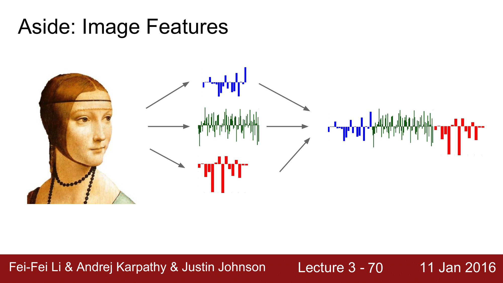
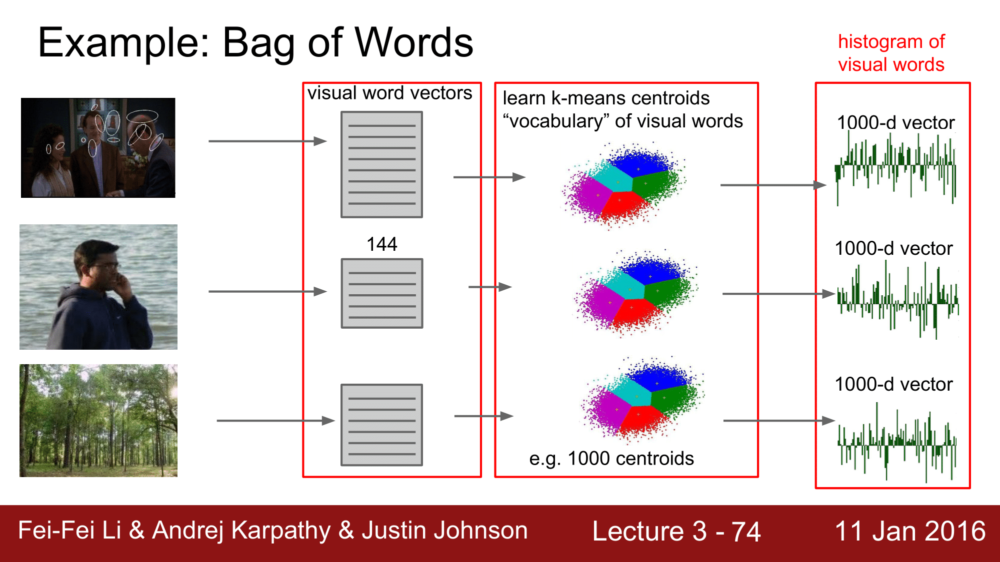

## Recall from last time
### Challenages in Visual Recognition
- Camera pose
- Illumination
- Deformation
- Occlusion
- Background clutter
- Intraclass variation

### 데이터 기반 접근 방식(Data-Driven Approach)
- KNN(k-Nearest Neighbor)

### Parametric Approach
- Linear Classifier

선형분류의 경우 두가지의 해석 방법이 존재하는데 이는 다음과 같다.
- 템플릿들을 매치해가는 과정 (i.e. Matching Template)
- 고차원 공간에 있는 이미지들 사이에서 클래스 Score를 기반으로 구분을 해 나가는 과정

## TODO
1. Loss function: Score에 대해 불만족하는 정도를 정량화 하는 손실함수(Loss function)에 대한 정의
2. Optimization: 손실함수를 최소화 하는 parameter를 효율적으로 찾는 방법


## 1. 손실 함수 (Loss function)
손실함수에는 다양한 함수들이 존재하는데 여기에서는 다음 두가지 함수에 대해 알아보도록 하자.
- SVM - Hinge Loss
- Softmax - Cross entorpy loss

### SVM - Hinge Loss
$x_i$ 가 이미지이고 $y_i$ 가 (정수형) 레이블일 때, score vector를 $s = f(x_i, W)$ 로 나타낼 수 있고 SVM loss 는 아래 식과 같은 형태로 나타낼 수 았다.

$$
    L_i = \Sum_{j!=y_i} max(0, s_j - s_{y_i} + 1)
$$

위 식을 살펴보면, max 함수 이기 떄문에 0과 $s_j - s_{y_i} + 1$ 중 큰 값을 반환한다는 의미이고, $s_j$는 잘못된 label의 스코어, $s_{y_j}$는 제대로된 label의 스코어이다. 그리고 뒤의 1은 safety margin이라고 한다.

이때 $s_j - s_{y_i} + 1$ 를 변형하면 $s_j - (s_{y_i} - 1)$가 되는데 이는 정답 레이블에서 1을 뺀 값이 잘못된 레이블의 스코어보다 작으면 0을 반환하고 이 보다 크면 해당 값을 반환하게 된다는 의미이다.

예를 들어, 고양이 이미지 class에 대한 값을 넣어 식을 살펴보면 다음과 같다.
$$ 
max(0, 5.1 - 3.2 + 1) + max(0, -1.7 - -3.2 + 1) 
\\ = max(0, 2.9) + max(0, -3.9)
\\ = 2.9 + 0
\\ = 2.9
$$ 

SVM loss 에서 $j = y_i$ 인 경우를 제외하여 계산하고 있는데, 이 경우를 포함하여 계산하게 되면 어떻게 될까?
$j = y_i$이면 $s_j = s_{y_i}$이기 때문에 결과적으로는 $\sum$ 한 값이 모두 $+1$ 이 되어버리기 때문에 그 평균값인 최종 loss 값도 $+1$인 값이 될 것이다. 

그리고 우리가 트레이닝 할 때 W값을 보통 0과 가까운 값(i.e. $s ~= 0$)을 주고 시작을 하게 되는데, 이 때의 Loss 값을 구해보면 위의 예에서는 2가 나옴을 알 수 있다. 즉, 처음 트레이닝 시에는 항상 Class의 개수 - 1의 값을 갖게 되는데 이를 이용하여 연산이 잘 되고 있음을 확인하는 것을 `Sanity Check` 라고 한다.

SVM loss 를 numpy code 로 보게 되면 다음과 같다.

$$
    L_i = \sum_{j\ne y_i} max(0, s_j - s_{y_i} + 1)
$$

``` python
def L_i_vectorized(x, y, W):
    scores = W.dot(x)
    margins = np.maximum(0, scores - scores[y] + 1)
    margins[y] = 0  # $j = y_i$인 경우에 대한 처리
    loss_i = np.sum(margins)
    return loss_i
```
여기에서 `x` 는 image single color vector 를, `y`는 lable을 나타내는 integer값을, `W`는 파라미터인 Weight Matrix를 의미한다.

이를 다시 수식으로 나타내게 되면 다음과 같다.
$$
f(x, W) = Wx \\
L = \frac{1}{N}\sum_{i=1}^{N} max(0, f(x_i; W)_j - f(x_i; W)_{y_j} + 1)
$$
하지만 위 수식에는 버그가 존재한다.
만약 $L = 0$ 이 되는 $W$를 발견했다고 했을 떄 이 $W$값이 unique 하지 않다는 것이다.

다음 식을 한번 봐보도록 하자.
$$ 
max(0, 1.3 - 4.9 + 1) + max(0, 2.0 - 4.9 + 1) 
\\ = max(0, -2.6) + max(0, -1.9)
\\ = 0 + 0
\\ = 0
$$
위의 W값을 2배 했을 때,
$$
max(0, 1.3 - 9.8 + 1) + max(0, 2.0 - 9.8 + 1) 
\\ = max(0, -6.2) + max(0, -4.8)
\\ = 0 + 0
\\ = 0
$$

위의 두 식을 보게 되면 W값이 다름에도 불구하고 $L = 0$이 됨을 알 수 있다.

이런 문제점 때문에 unique 한 W값을 만들기 위해 Regularization strength 라는 lamda 값(hyperparameter)을 도입합니다.
$$
L = \frac{1}{N}\sum_{i=1}^{N} max(0, f(x_i; W)_j - f(x_i; W)_{y_j} + 1) + \lambda R(W)
$$
$\lambda R(W)$ 값은 W가 얼마나 괜찮은가에 대한 정도를 측정하는 역할을 수행합니다.

좌측항 $\frac{1}{N}\sum_{i=1}^{N} max(0, f(x_i; W)_j - f(x_i; W)_{y_j} + 1)$ 을 `data loss`라고 하는데 이 부분은 학습용 데이터를 최대한 최적화하기 위한 수식이고,
`regularization loss`라고 하는 우측항 $\lambda R(W)$은 테스트 셋에 최대한 일반화를 하기 위한 수식이다.

이렇게 좌측항과 우측항이 서로 값을 조정하면서 데이터에 가장 최적화 되고 가장 작은 `W`값을 추출하게 되는 것이다.
`regularization loss`의 값에 의해 트레이닝 시에 에러가 커질 수 있지만; 즉 정확도가 낮아질 수 있지만, 우리가 더 중요시하고 있는 테스트에 대한 performance는 더 좋아질 수 있다.

또 다른 관점에서는 `regularization loss`입장에서는 W가 0이 되길 원하고 `data loss`에서는 W가 0이 될 수는 없기 때문에 서로 값을 조정하면서 더 좋은 W 값을 도출해 낼 수 있다.

`regularization loss`로 보통 다음과 같은 것들을 사용한다.
- L2 regularization
- L1 regularization
- Elastic net (L1 + L2)
- Max norm regularization
- Dropout

#### L2 regularization의 동기

$$
\\ x = [1, 1, 1, 1] 
\\ w_1 = [1, 0, 0, 0]
\\ w_2 = [0.25, 0.25, 0.25, 0.25]
$$
$$
w_{1}^{T}x = w_{2}^{T}x = 1
$$

위 식에 대해서 loss 를 계산하게 되면 $w_1, w_2$ 에 대한 결과가 모두 1이 되는데 regularization에서는 $w_2$ 의 값을 더 선호한다.(i.e. diffuse over everything)

이에 대한 해석은 다음과 같다.

$w_2$의 경우 $x$에 대해 모든 값에 영향을 주는 반면, $w_1$의 경우 하나의 값에만 영향을 주게 되는데, Regularization의 경우 weight 를 최대한 spread out 해서 모든 input feature 들을 고려하길 윈하기 때문이다.


### Softmax Classifier (Multinomial Logistic Regression)

Softmax Classifier란 이항에 대한 Logistic Regression을 다차원으로 일반화 한 것이라고 할 수 있다.

여기서 `scores` 는 `클래스를 log 화 한 확률 (not normalized)`을 나타내고 이를 식으로 표현하면 다음과 같다.
$$
P(Y = k|X = x_i) = \frac{e^sk}{\sum_j e^sj} \quad where\quad s = f(x_i \cdot W)
$$
이때, $\frac{e^sk}{\sum_j e^sj}$를 Softmax function이라고 한다.

근데 여기서 하고자 하는 것은 클래스에 대한 $-log$ 의 확률을 최대화 하는 것이기 때문에 위의 식은 아래와 같이 쓸 수 있으며
$$
L_i = -log P(Y = y_iu|X = x_i)
$$
이를 정리하면 다음과 같아지는데, 이 아래의 수식을 `cross entropy loss`라고 부른다.
$$
L_i = -log(\frac{e^sy_i}{\sum_j e^sj})
$$

Softmax 에서는 $-log(x)$ 의 형태로 식이 전개 되는데 이를 형태를 그래프로 보게 되면 


위와 같이 되는데 Softmax Loss는 확률이기 때문에 $0\le x \le 1$의 범위를 갖게되고, 때문에 최대 최소의 범위는 $0 \le y < \infty$ 이 된다.

이전에 살펴봤던 SVM에서는 `sanity check` 값이 "클래스 개수 - 1"이 었었는데 Softmax 에서는 위의 수식에 0을 넣어보면 알 수 있듯이, $\frac{1}{number\ of\ class}$가 됨을 알 수 있다.

### Softmax vs, SVM

그럼 Softmax 와 SVM을 비교해보자.
$$
    L_i = -log(\frac{e^sy_i}{\sum_j e^sj})\qquad L_i = \sum_{j\ne y_i} max(0, s_j - s_{y_i} + 1)
$$
현업에서는 Softmax가 SVM에 비해 더 많이 사용되는데 그 이유는 SVM의 경우 수식 뒷부분에 $+1$를 해주는 `safety margin`이 존재해서 이 값 때문에 데이터의 변화에 대해 둔감한 반면, Softmax의 경우 `safety margin`과 같은 인자값이 존재하지 않아 데이터 변화에 대해 더 민감하게 반응할 수 있기 때문에 그렇다.

## 2. 최적화(Optimization)

Optimization이란 기본적으로 loss 를 minimize 하는 weight를 찾아가는 과정이라고 생각을 하면 된다.

### Recap
앞의 내용을 다시 한번 정리해보면 다음과 같다.
- $(x, y)$에 대한 dataset
- **score function** 이 $s = f(x; W) =^{e.g.} Wx$ 
- **loss function**
    - Softmax: $L_i = -log(\frac{e^sy_i}{\sum_j e^sj})$
    - SVM: $\sum_{j\ne y} max(0, s_j - s_{y_j} + 1)$
    - Full loss: $L = \frac{1}{N}\sum_{i=1}^N L_i + R(W)$
 
 > Full loss 에서 Regularization function는 데이터에 영향을 받는 함수가 아니라 W(Weight)에 영향을 받는 함수 라는 점을 기억해두자.

 ### 최적화 전략(Optimization Strategy)

 다시 본론으로 돌아와서 최적화를 위한 전략에는 Random Search와 Follow the slope 가 있는데 하나씩 살펴보도록 하자.

 #### Strategy #1. Random search 

 랜덤 서치는 최적화 전략 중 하나이긴 하지만 절대로 사용하면 안되는 전략인데, 이에 대한 코드를 보며 설명해보도록 하겠다.
 
``` python
# assume X_train is tthe data where each column is an example (e.g. 3073 x 50,000)
# assume Y_train are the labels (e.g. ID array of 50,000)
# assume the function L evaluates the loss function

bestloss = float("inf") # Python assigns the highest possible float value
for num in xrange(1000):
    W = np.random.randn(10, 3073) * 0.0001  # generate random parameters
    loss = L(X_train, Y_train, W)   # get the loss over the entire training set
    if loss < bestloss: # keep track of the best solution
        bestloss = loss
        bestW = W
    print ('in attempt %d the loss was %f, best %f' % (num, loss, bestloss))

# prints:
# in attempt 0 the loss was 9.401632, best 9.401632
# in attempt 1 the loss was 8.959668, best 8.959668
# in attempt 2 the loss was 9.044034, best 8.959668
# in attempt 3 the loss was 9.278948, best 8.959668
# in attempt 4 the loss was 8.857370, best 8.857370
# in attempt 5 the loss was 8.943151, best 8.857370
# in attempt 6 the loss was 8.605604, best 8.605604
# ... (truncated: continues for 1000 lines)
```

위와 같이 1000 회를 반복해서 예측을 하게 되는데

결과를 보면 다음과 같이 15.5%의 정확도를 얻어, SOTA(state of the art) 즉 최고기록은 95% 정도임을 알 수 있다.

``` python
# Assume X_test is [3073 x 10000], Y_test [10000 x 1]
scores = Wbest.dot(Xte_cols)    # 10 x 10000, the class scores for all test examples
Yte_predict = np.argmax(scores, axis=0)
# and calculate accuracy (fraction of predictions that are correct)
np.mean(Yte_predict == Yte)
# returns 0.1555
```

Optimization을 해 나가는 과정은 산속에서 눈을 가리고 가장 낮은 곳을 찾아가는 과정이라고 할 수 있는데, `random search`의 경우 여기 저기 순간이동을 하면서 가장 낮은 곳을 찾는 방법이기 때문에 좋은 방법이라고 할 수 없다는 것을 알 수 있습니다.

그렇기 때문에 실질적으로 `random search`를 사용하지 않고 다음으로 소개하는 `follow the slope` 전략을 사용합니다.

#### Strategy #2. Follow the slope

`follow the slope` 전략은 경사를 따라가는 전략으로 1차원의 경우의 식은 다음과 같습니다.

$$
    \frac{df(x)}{dx} = \lim_{h\rightarrow0} \frac{f(x + h) -  f(x)}{h}
$$

고등학교 수학시간에 배우는 1차함수 미분식인데, 이것을 수치미분(numerical gradient)이라고 합니다.

> 1차원의 경우가 아닌, 다 차원의 경우 x 가 vector의 형태로 사용하게 됩니다.

이 수치미분 식을 다차원의 형태로 확장하여 코드로 작성하게 되면 다음과 같습니다.

``` python
def eval_numerical_gradient(f, x):
"""
a navie implementation of numerical gradient of f at x
- f should be a function that takes a single argument
- x is the point (numpy array) to evaluate the gradient at
"""

fx = f(x)   # evaluate function value at original point
grad = np.zeros(x.shape)
h = 1e-5

# iterate over all indexes in x
it = np.nditer(x, flags=['multi_index'], op_flags=['readwrite'])
while not it.finished:

    # evalueate function at x+h
    ix = it.multi_index
    old_value = x[ix]
    x[ix] = old_value + h # increment by h
    fxh = f(x) # evaluate f(x + h)
    x[ix] = old_value # restore to previous value (very important!)

    # compute the partial derivative
    grad[ix] = (fxh - fx) / h # the slope
    it.iternext()   # step to next dimension

return grad
```

그렇지만 위와같이 수치미분으로 값을 계산하게 되면 정확한 값을 구할 수 없고(i.e. 근사치를 구하게 됨), 또한 loop를 돌면서 값을 하나씩 구하기 때문에 속도가 현저하게 떨어지게 됩니다.

**numerical gradient's feature**
- approximate
- very slow to evaluate

우리가 구하려고 하는 것은 W의 변화량에 따른 loss 의 변화량이기 떄문에, 결과적으로 위와 같이 수치미분을 하여 값을 구하는 것은 어리석은 방식입니다.

때문에 실제로는 다음과 같이 `analytic gradient`를 이용하게 됩니다.
$$
\begin{aligned}
& L =  \frac{1}{N}\sum_{i=1}^{N} L_i + \sum_k W_k^2 \\
& L_i = \sum_{j \ne y_i} max(0, s_j - s_{y_i} + 1) \\
& s = f(x; W) = Wx \\ \\
& \nabla wL\\
\end{aligned}
$$

### Summary
이렇게 수치미분과 해석미분에 대해서 알아보았는데 각 특징을 정리하면 다음과 같습니다.

- 수치미분(Numerical gradient)은 근사치이고 느리지만 구현이 쉽다.
- 해석미분(Analytic gradient)은 정확하고 빠르지만 구현이 어렵다(error-prone).

따라서, 실제로는 항상 해석미분을 사용하여 미분 값을 구하고 수치미분을 이용해서 해석미분을 한 결과가 오류가 없는지 확인하는 방식(i.e. `gradient check`)으로 사용하게 됩니다.

### 경사하강법(Gradient Descent)

다시 돌아와 경사하강법(Gradient Descent)를 코드로 살펴보게 되면 다음과 같습니다.

``` python
# Vanilla Gradient Descent

while True:
    weights_grad = evaluate_gradient(loss_fun, data, weights)
    weights += - step_size * weights_grad   # perform parameter update
```

위 코드를 한번 살펴보면, step_size 는 `learning rate`로 수식에서는 일반적으로 $\alpha$ 로 표현이 되는 것이고, gradient 의 값만큼 $W$를 감소시켜 주어야 하기 때문에 - 부호를 붙여서 weight 에서 해당 값을 빼주게 됩니다.

> `learning rate` 와 앞에서 살펴봤던 `regularization strength` 값은 가장 골치아픈 `hyperparameter` 값으로, `validation set`을 이용해서 최적의 값을 찾아주어야 하는 것이 필요합니다.


그림을 통해 살펴보면, original W 가 음의 gradient 방향으로 계속 이동을 하면서 $W$를 계속해서 최적화를 해 나가는 것이 gradient descent가 되겠습니다.

### 미니배치를 이용한 경사하강법(Mini-batch Gradient Descent)

앞에서 설명했던 `Gradient Descent`는 `full-batch gradient descent`입니다. 

현실에서는 보통 `Mini-batch Gradient Descent`를 사용하여 $W$를 업데이트 하는데, 한번에 모든 Training Set을 메모리에 올려서 `Gradient Descent`를 진행하는 것이 비효율적이기 때문입니다. 따라서 미니배치를 이용하여 training set을 여러개의 작은 batch로 나누어 wegiht를 계속해서 수정해나가는 방식으로 기울기 감소를 진행합니다.

코드로 보면 다음과 같습니다.
``` python
# Vanilla Minibatch Gradient Descent

while True:
    data_batch = sample_training_data(data, 256)    # sample 256 examples
    weights_grad = evaluate_gradient(loss_fun, data_batch, weights)
    weights += - step_size * weights_grad   # perform parameter update
```
일반적으로 mini-batch size는 32/64/128과 같은 값으로 진행을 하게 됩니다.

> AlexNet(2012)에서는 256개의 mini-batch를 활용했다고 합니다.
> 여기서 mini-batch size를 어떻게 정할 것인가에 대한 것은 하이퍼파라미터까지는 아니고 학습을 진행하는 하드웨어 환경(cpu, gpu, meomory size)를 고려해서 설정해주면 됩니다.

#### 학습률(Learning rate)

여기서 잠깐 learing rate가 기울기 학습에 미치는 영향에 대해 살펴보겠습니다.


좌측의 그래프는 시간이 증가함에 따라 loss 가 전반적으로 감소하는 것을 보여주는 것인데, 값이 위아래로 왔다갔다 하는 것을 볼 수 있습니다. 이는 미니배치를 사용하므로써 보이는 노이즈 입니다. 

이런 노이즈가 생기는 이유는 특정 mini-batch size만큼의 한정적인 데이터만을 가지고 $W$를 업데이트 하기 때문에 경우에 따라 loss 가 잠깐 증가하거나 감소하는 것이 반복되어서 그렇습니다. 

하지만 장기적으로 보았을 떄 loss 가 서서히 내려가면서 올바른 값을 찾아가는 것을 볼 수 있습니다.

우측의 그래프는 `learing rate` 값을 어떻게 설정하느냐에 따라 loss 값이 어떻게 변하게 되는지를 보여주는 그래프입니다.

만약에 lr(learning rate)를 너무 크게 잡게 되면, 보이는 바와 같이 loss 가 감소하는 것이 아니라 diverge 하거나 explode 하는 것을 볼 수 있고, lr을 너무 작게 잡게 되면 loss 가 최저점까지 걸리는 시간이 너무 오래걸린다는 것(slow convergence)을 볼 수 있습니다. 

또한 lr이 좀 높은 경우에는 loss가 최저점에 도달하지 못하는 것을 볼 수 있습니다. 이런 경우 global minimum 지점에 빠지지 않고 local minimum 지점에 빠지게 된 경우라고 할 수있습니다. 

마지막으로 lr을 적절하게 두게 되면, 빠른 시간 내에 loss 가 최소화되는 것을 확인할 수 있습니다.

> 위 그래프를 보면 알 수 있듯이 learing rate를 설정하는 것은 매우 어렵기 떄문에 lr 을 높은 값에서 부터 낮은 값으로 `decay`해 나가며 적절한 lr 값을 설정하는 경우가 많습니다.

이런 `Mini-batch Gradient Descent`의 대표적인 예로 `stochastic GD`라는 것이 있고, 파라미터를 업데이트 하는 방법으로 `Gradient Descent`만 있는 것이 아니라 `Momentum`, `Adagrad`, `RMSProp`, `Adam` 등이 있습니다.

예를 들어 `Momentum` 같은 경우, loss 가 줄어드는 속도까지 고려하여 진행하기 때문에 더 빠르게 loss 의 최소치에 도달할 수 있습니다. 이러한 다양한 방법에 대해서는 이후 Lecture.4에서 설명하겠습니다.


위 이미지는 각 formula들이 어떠한 방식으로 최저치를 찾아가는지를 보여줍니다. 

여기서 SGD의 경우 끝없이 계속해서 값을 찾아가는 것을 볼 수 있듯이 굉장히 느리게 진행됩니다. 그리고 Momentum의 경우 아래까지 over-shooting을 했다가 빠르게 목표치까지 도달하는 것을 볼 수 있습니다.

## Image Classification 의 고전적 방법

지금부터는 CNN(Convolutional Neural Network)이 나오기 이전에 사용했었던 이미지 분류 방법에 대해 참고로 알아보겠습니다.



전통적인 방식에서도 CNN에서와 같이 Linear Classifier를 이용했습니다. 하지만 모든 이미지를 커버해야 했기 때문에 Original Image 에 적용하지는 않았고, Image로 부터 feature를 추출하여 거기에 Linear Classifier를 적용했습니다.

먼저 Hog, Color histogram 과 같은 feature를 추출하고 이들을 gient color vector처럼 결합시킵니다. 그 다음 결합된 vector를 Linear Classifier 에 적용을 합니다.

이것이 일반적인 방법이었습니다.

그래서 feature를 추출하는 방식을 보게 되면 다음과 같습니다.

### Color (Hue) Histogram


첫번째가 바로 `Feature Histogram` 인데, 이때 feature 가 color가 됩니다.

위와 같이 이미지가 있을 때, 먼저 모든 pixel 들의 color를 파악을하고, 그 전체 color 파노라마에 대해 각각에 color에 해당하는 bin이 몇 개 인지 count하여 feature를 추출하는 방식입니다.

### Hog/SIFT features


두번째로 Feature를 추출하는 방식은 `Hog/SIFT` 방식입니다.

이는 주로 엣지(Edge)의 방향; Orientation을 feature로 추출하는 것인데, 오른쪽 그림과 같이 8x8 pixel 로 되어있는 부분을 보면서 엣지들의 방향을 총 9가지로 구분하여, 9가지의 bin에 총 몇개가 속하는가를 기준으로 해서 edge의 orientation을 feature로 추출하는 방식입니다.

이와 유사한 방식으로 `GIST`, `LBP`, `Texton` `SSIM` 등 과같은 방식이 존재합니다.

### Bag of Words



세번째 방법으로는 `Bag of Words` 라는 방식이 있습니다.

이 방식은 가장 왼쪽의 각 이미지의 지점들을 보고 그 작은 local patch들을 frequency, color와 같은 featrue 에 대해 vector로 기술합니다. 이렇게 기술된 vector를 모아 dictionary 화 합니다. 이렇게해서 생성된 dictionary 들 중 테스트하려는 이미지와 가장 feature 가 유사한 vector를 `k-means`를 이용하여 dictionary 내에서 찾습니다. 그렇게 하여 feature들을 추출하고 concatenation을 한 다음 Linear Classifier를 적용해주는 방식입니다.

### Summary


이처럼 전통적인 방식에서는 여러가지 방식을 이용하여 Feature를 Extraction하고 이것들을 concatenation 해준 다음에 Linear Classifier의 인자로 던져줌으로써 결과값을 얻습니다.

하지만 우리가 접근하고 있는 `Deep Learning` 방식에서는 위 전통적인 방식들과는 다르게 Feature 추출을 임의의 방식으로 하는 것이 아니라 Original Image를 Classifier에 넣어 Training 된 Model이 결과값을 알아서 출력해주는 방식인 것입니다.

다음시간에는 역전파(Backpropagation)와 신경망(Neural Network)에 대해 알아보겠습니다.

